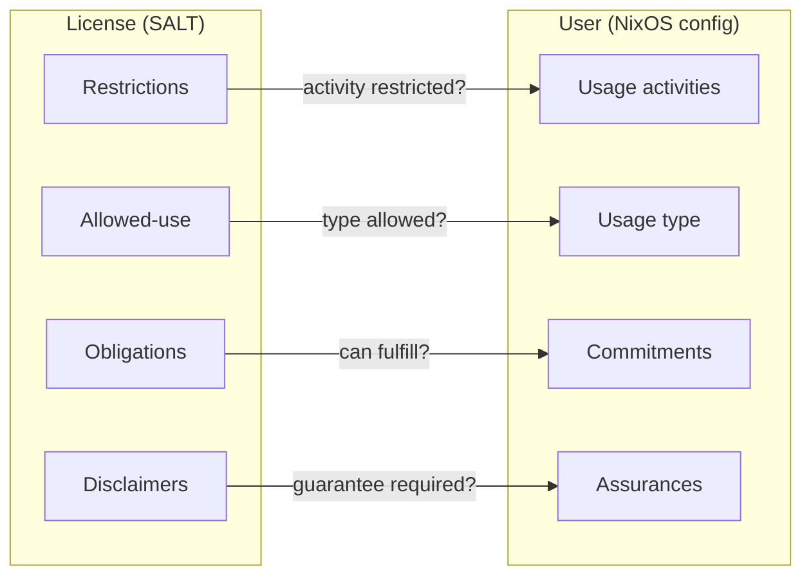
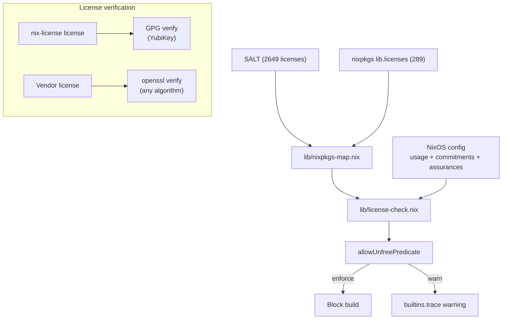

# Architecture

## Structure

```
nix-license/
├── keys/
│   ├── yubikey1.asc
│   ├── yubikey2.asc
│   └── vendors/              # Embedded vendor public keys
├── lib/
│   ├── licensing/
│   │   ├── check.nix         # Four compliance checks
│   │   ├── license.nix       # License construction, authorization, restriction
│   │   └── verify.nix        # GPG + openssl signature verification
│   ├── content-rating/
│   │   ├── types.nix         # OARS categories, severity, presets
│   │   ├── rating.nix        # Policy resolution, evaluation
│   │   └── severity.nix      # Shared severity levels
│   ├── commercial/
│   │   └── reporting/        # Report generation (commercial feature)
│   │       ├── report.nix
│   │       └── template.html
│   ├── salt.nix              # SALT license data
│   ├── nixpkgs-map.nix       # nixpkgs → SALT mapping
│   └── options.nix           # Shared module options
├── modules/
│   ├── default.nix           # Standalone NixOS module (nix-license.*)
│   └── mynixos.nix           # mynixos integration (my.license.*)
├── tests/
│   ├── licensing/
│   │   ├── restrictions.nix  # 2649 × 16 restriction enforcement
│   │   ├── allowed-use.nix   # 2649 × 6 type checks
│   │   ├── obligations.nix   # 2649 × 16 obligation triggers
│   │   ├── commitments.nix   # 2649 commitment blocking
│   │   ├── assurances.nix    # 2649 × 3 assurance blocking
│   │   ├── monotonicity.nix  # Adding flags never removes conflicts
│   │   ├── check.nix         # Targeted checks
│   │   ├── license.nix       # License construction, authorization
│   │   ├── verify.nix        # Claim validation
│   │   └── fixtures/         # Signed test licenses
│   ├── content-rating/
│   │   ├── severity.nix      # Total order properties
│   │   ├── policy.nix        # Hierarchy, stability
│   │   ├── rating.nix        # Evaluation tests
│   │   └── types.nix         # Categories, presets
│   ├── nixpkgs-map.nix       # 289/289 mapping + regression tests
│   └── module-standalone.nix # Module scenarios, commercial gate
├── examples/                  # Usage examples + report generation
└── docs/
```

## Domain model

Every license carries terms. Every user declares their context. nix-license evaluates one against the other.

**License side** ([SALT](https://github.com/i-am-logger/salt) — 2649 classified licenses):

| Term | What it is | Example |
|------|-----------|---------|
| Restrictions | What the license prohibits | `commercial-use`, `distribution`, `modifications`, `saas`, `endorsement`, `competing-use` |
| Allowed-use | Who the license permits | `educational`, `research` |
| Obligations | What the license requires you to do | `disclose-source`, `same-license`, `include-copyright` |
| Disclaimers | What the license doesn't guarantee | `liability`, `warranty`, `patent-use`, `trademark-use` |

**User side** (your NixOS config):

| Term | What it is | Example |
|------|-----------|---------|
| Usage (type) | Who you are | `personal`, `commercial`, `nonprofit`, `educational` |
| Usage (activities) | What you do | `commercial-use`, `distribution`, `modifications`, `saas` |
| Commitments | Which obligations you can fulfill | `same-license = false` (can't open-source) |
| Assurances | What guarantees you require | `patent-grant = true` (require patent rights) |

**Evaluation** — four compliance checks, all must pass:

| License | User | Blocks when |
|---------|------|-------------|
| Restrictions | Usage (activities) | Activity is restricted |
| Allowed-use | Usage (type) | Type not in allowed list |
| Obligations | Commitments | Obligation triggers and user can't commit |
| Disclaimers | Assurances | License disclaims what user requires |



See [SALT TERMS.md](https://github.com/i-am-logger/salt/blob/master/TERMS.md) for the complete vocabulary.

## Data flow



## Data sources

| Flake input | Source | What we use |
|-------------|--------|-------------|
| `salt` | [i-am-logger/salt](https://github.com/i-am-logger/salt) | 2649 license classifications |
| `oars` | [hughsie/oars](https://github.com/hughsie/oars) | Content rating categories from RNC schema |

## License evaluation

Four compliance checks per license (all must pass):

1. **Restrictions** (blocklist): if the license restricts an activity and the user does that activity → conflict
2. **Allowed-use** (allowlist): if the license specifies who can use it and the user's type isn't in the list → conflict
3. **Commitments**: if an obligation triggers and the user can't commit to fulfilling it → conflict
4. **Assurances**: if the license disclaims something the user requires → conflict

Triggered obligations are also returned for reporting but do not block on their own — they are blocked via commitments (check 3).

## nixpkgs mapping

`lib/nixpkgs-map.nix` maps every nixpkgs license to its SALT equivalent. Lookup order:

1. `spdxId` → `salt.spdx.${spdxId}` (234 licenses)
2. Manual map for known mismatches (55 entries, e.g. `asl20` → `apache-2.0`, `unfreeRedistributable` → `proprietary-redistributable`)
3. `shortName` → `salt.licenses.${shortName}` (direct key match)
4. `null` → module throws (unknown license must fail)

All 289 nixpkgs licenses are verified to map successfully (tested in `nixpkgs-map.nix`).

## Usage declaration

```nix
usage = {
  type = "commercial";     # who you are (checked against allowed-use)
  commercial-use = true;   # what you do (checked against restrictions)
  distribution = false;
  modifications = true;
  saas = false;
};
```

All fields required, no defaults.

## Library API

### License evaluation (`lib.licenseCheck`)

| Function | Description |
|----------|-------------|
| `evaluateLicenseUsage` | Check usage against license restrictions + allowed-use |

### Content rating (`lib.contentRating`)

| Function | Description |
|----------|-------------|
| `severityAllowed` | Is this severity level within the policy maximum? |
| `resolveContentPolicy` | Resolve a preset or attrset into a full content policy |
| `evaluateContentRating` | Evaluate a package's content rating against a policy |

### License operations (`lib.licensing.license`)

| Function | Description |
|----------|-------------|
| `mkLicense` | Create a license |
| `evaluateAuthorizations` | Check license authorizations against usage |
| `isValidRestriction` | Can this license be restricted further? |
| `restrictLicense` | Apply a restriction (returns null if invalid) |
| `validateLicense` | Full license validation |

## Domain model guarantees

| Guarantee | Scope | Verified by |
|-----------|-------|-------------|
| Restriction enforcement | 2649 × 16 | licensing/restrictions |
| Allowed-use enforcement | 2649 × 6 | licensing/allowed-use |
| Obligation triggers | 2649 × 16 | licensing/obligations |
| Commitments block when can't fulfill | 2649 | licensing/commitments |
| Commitments=true never blocks | 2649 × 16 | licensing/commitments |
| No assurances = no assurance blocks | 2649 × 16 | licensing/assurances |
| Assurances block/allow correctly | 2649 × 3 | licensing/assurances |
| Monotonicity (adding flags never removes conflicts) | 2649 × 5 | licensing/monotonicity |
| No restrictions = universally allowed | unrestricted × 16 | licensing/restrictions |
| Empty usage = no conflicts | 2649 | licensing/monotonicity |
| Severity levels form a total order | all intensities | content-rating/severity |
| Content policy presets ordered (restricted < teen < unrestricted) | all categories | content-rating/policy |
| Relaxing a policy never removes access | all presets | content-rating/policy |
| All nixpkgs licenses map to SALT | 289/289 | nixpkgs-map |
| unfreeRedistributable allows distribution | regression | nixpkgs-map |
| Multi-license packages (all must pass) | targeted | nixpkgs-map |
| Assurance key mapping with real SALT data | targeted | nixpkgs-map |
| GPG license signature verification | build-time | self-license-verify |
| Vendor license signature verification (openssl) | build-time | vendor-license-verify |
| License claim validation | 12 cases | licensing/verify |
| Usage assertions catch invalid combinations | targeted | module-standalone |
| Commercial gate requires license in enforce mode | targeted | module-standalone |
| Example reports evaluate correctly | 6 scenarios | example-* |

Every license (2649) is evaluated and tested against every usage context (16 activity combinations × 6 user types × 7 commitment keys × 3 assurance keys), producing over 200,000 individual pass/fail checks per `nix flake check`.
