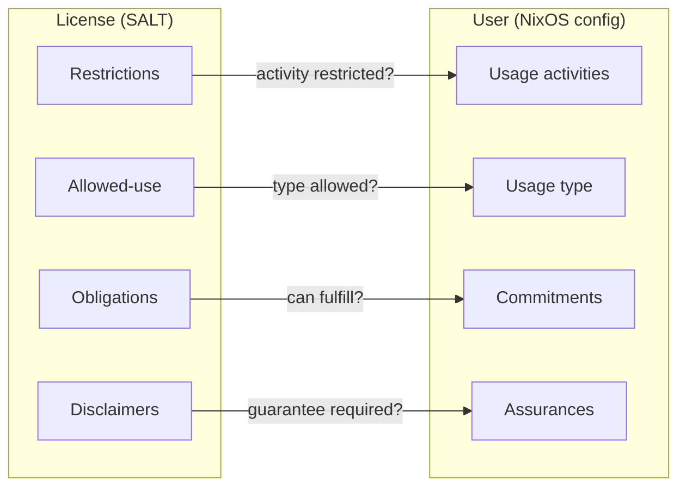
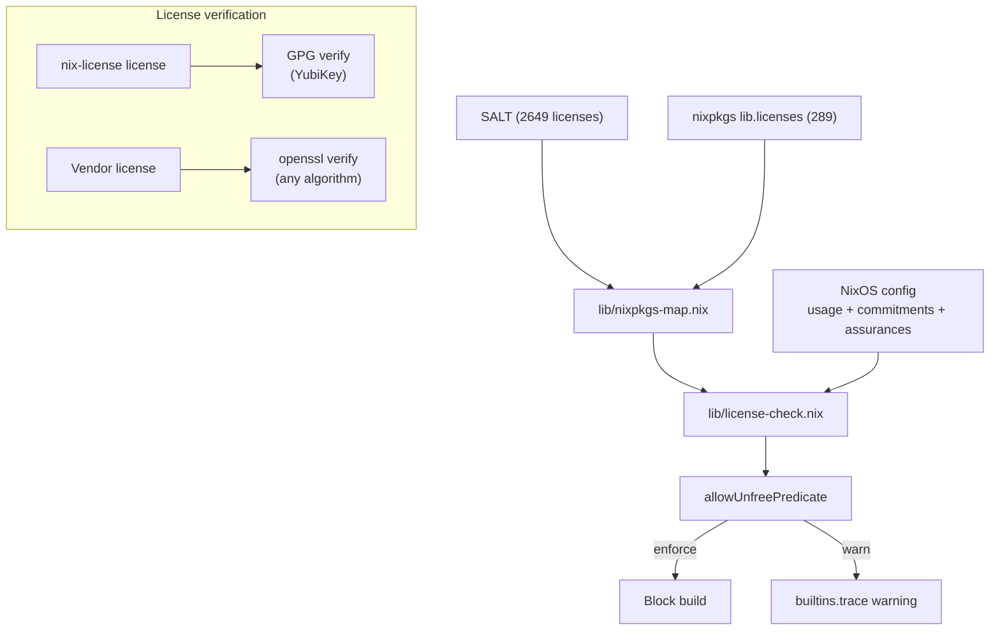

# Architecture

## Structure

```
nix-license/
├── keys/
│   ├── yubikey1.asc          # Author public key (YubiKey 1)
│   └── yubikey2.asc          # Author public key (YubiKey 2)
├── lib/
│   ├── types.nix             # OARS categories + severity values (from upstream RNC schema)
│   ├── content-rating.nix    # Content policy resolution and evaluation
│   ├── license-check.nix     # Four compliance checks + obligation reporting
│   ├── licenses.nix          # License definitions from SALT
│   ├── nixpkgs-map.nix       # Maps nixpkgs licenses to SALT (spdxId → manual → key)
│   ├── self-license.nix      # Commercial gate: GPG + openssl license verification
│   └── token.nix             # License construction, restriction, validation
├── modules/
│   ├── default.nix           # Standalone NixOS module (nix-license.*)
│   └── mynixos.nix           # mynixos integration (my.license.* + my.users.<name>.*)
├── tests/
│   ├── fixtures/             # Signed test licenses (GPG + Ed25519)
│   ├── lib-types.nix         # OARS categories, presets
│   ├── lib-content-rating.nix # Severity, policy resolution, content evaluation
│   ├── lib-licenses.nix      # Commitments, assurances, restriction checks
│   ├── lib-token.nix         # License authorization, restriction, expiry
│   ├── lib-properties.nix    # 200,000+ domain model guarantees
│   ├── nixpkgs-map.nix       # 289/289 mapping + regression tests
│   ├── self-license.nix      # License claim validation
│   └── module-standalone.nix # Module scenarios, commercial gate, assertions
└── docs/
```

## Domain model

Every license carries terms. Every user declares their context. nix-license evaluates one against the other.

**License side** ([SALT](https://github.com/i-am-logger/salt) — 2649 classified licenses):

| Term | What it is | Example |
|------|-----------|---------|
| Restrictions | What the license prohibits | `commercial-use`, `distribution`, `modifications`, `saas`, `endorsement`, `competing-use` |
| Allowed-use | Who the license permits | `educational`, `research` |
| Obligations | What the license requires you to do | `disclose-source`, `same-license`, `include-copyright` |
| Disclaimers | What the license doesn't guarantee | `liability`, `warranty`, `patent-use`, `trademark-use` |

**User side** (your NixOS config):

| Term | What it is | Example |
|------|-----------|---------|
| Usage (type) | Who you are | `personal`, `commercial`, `nonprofit`, `educational` |
| Usage (activities) | What you do | `commercial-use`, `distribution`, `modifications`, `saas` |
| Commitments | Which obligations you can fulfill | `same-license = false` (can't open-source) |
| Assurances | What guarantees you require | `patent-grant = true` (require patent rights) |

**Evaluation** — four compliance checks, all must pass:

| License | User | Blocks when |
|---------|------|-------------|
| Restrictions | Usage (activities) | Activity is restricted |
| Allowed-use | Usage (type) | Type not in allowed list |
| Obligations | Commitments | Obligation triggers and user can't commit |
| Disclaimers | Assurances | License disclaims what user requires |



See [SALT TERMS.md](https://github.com/i-am-logger/salt/blob/master/TERMS.md) for the complete vocabulary.

## Data flow



## Data sources

| Flake input | Source | What we use |
|-------------|--------|-------------|
| `salt` | [i-am-logger/salt](https://github.com/i-am-logger/salt) | 2649 license classifications |
| `oars` | [hughsie/oars](https://github.com/hughsie/oars) | Content rating categories from RNC schema |

## License evaluation

Four compliance checks per license (all must pass):

1. **Restrictions** (blocklist): if the license restricts an activity and the user does that activity → conflict
2. **Allowed-use** (allowlist): if the license specifies who can use it and the user's type isn't in the list → conflict
3. **Commitments**: if an obligation triggers and the user can't commit to fulfilling it → conflict
4. **Assurances**: if the license disclaims something the user requires → conflict

Triggered obligations are also returned for reporting but do not block on their own — they are blocked via commitments (check 3).

## nixpkgs mapping

`lib/nixpkgs-map.nix` maps every nixpkgs license to its SALT equivalent. Lookup order:

1. `spdxId` → `salt.spdx.${spdxId}` (234 licenses)
2. Manual map for known mismatches (55 entries, e.g. `asl20` → `apache-2.0`, `unfreeRedistributable` → `proprietary-redistributable`)
3. `shortName` → `salt.licenses.${shortName}` (direct key match)
4. `null` → module throws (unknown license must fail)

All 289 nixpkgs licenses are verified to map successfully (tested in `nixpkgs-map.nix`).

## Usage declaration

```nix
usage = {
  type = "commercial";     # who you are (checked against allowed-use)
  commercial-use = true;   # what you do (checked against restrictions)
  distribution = false;
  modifications = true;
  saas = false;
};
```

All fields required, no defaults.

## Library API

### License evaluation (`lib.licenseCheck`)

| Function | Description |
|----------|-------------|
| `evaluateLicenseUsage` | Check usage against license restrictions + allowed-use |

### Content rating (`lib.contentRating`)

| Function | Description |
|----------|-------------|
| `severityAllowed` | Is this severity level within the policy maximum? |
| `resolveContentPolicy` | Resolve a preset or attrset into a full content policy |
| `evaluateContentRating` | Evaluate a package's content rating against a policy |

### License tokens (`lib.token`)

| Function | Description |
|----------|-------------|
| `mkLicenseToken` | Create a license license |
| `evaluateTokenAuthorizations` | Check license authorizations against usage |
| `isValidTokenRestriction` | Can this license be restricted further? |
| `restrictToken` | Apply a restriction (returns null if invalid) |
| `validateToken` | Full license validation |

## Domain model guarantees

| Guarantee | Scope | Verified by |
|-----------|-------|-------------|
| Restriction enforcement | 2649 × 16 | lib-properties |
| Allowed-use enforcement | 2649 × 6 | lib-properties |
| Obligation triggers | 2649 × 16 | lib-properties |
| Commitments block when can't fulfill | 2649 | lib-properties |
| Commitments=true never blocks | 2649 × 16 | lib-properties |
| No assurances = no assurance blocks | 2649 × 16 | lib-properties |
| Assurances block/allow correctly | 2649 × 3 | lib-properties |
| Monotonicity (adding flags never removes conflicts) | 2649 × 5 | lib-properties |
| No restrictions = universally allowed | unrestricted × 16 | lib-properties |
| Empty usage = no conflicts | 2649 | lib-properties |
| Severity levels form a total order | all intensities | lib-properties |
| Content policy presets ordered (child < teen < unrestricted) | all categories | lib-properties |
| Relaxing a policy never removes access | all presets | lib-properties |
| All nixpkgs licenses map to SALT | 289/289 | nixpkgs-map |
| unfreeRedistributable allows distribution | regression | nixpkgs-map |
| Multi-license packages (all must pass) | targeted | nixpkgs-map |
| Assurance key mapping with real SALT data | targeted | nixpkgs-map |
| GPG license signature verification | build-time | self-license-verify |
| Vendor license signature verification (openssl) | build-time | vendor-token-verify |
| License claim validation (package, commercial, expiry) | 12 cases | self-license-claims |
| Usage assertions catch invalid combinations | targeted | module-standalone |
| Commercial gate requires license in enforce mode | targeted | module-standalone |

Every license (2649) is evaluated and tested against every usage context (16 activity combinations × 6 user types × 7 commitment keys × 3 assurance keys), producing over 200,000 individual pass/fail checks per `nix flake check`.
