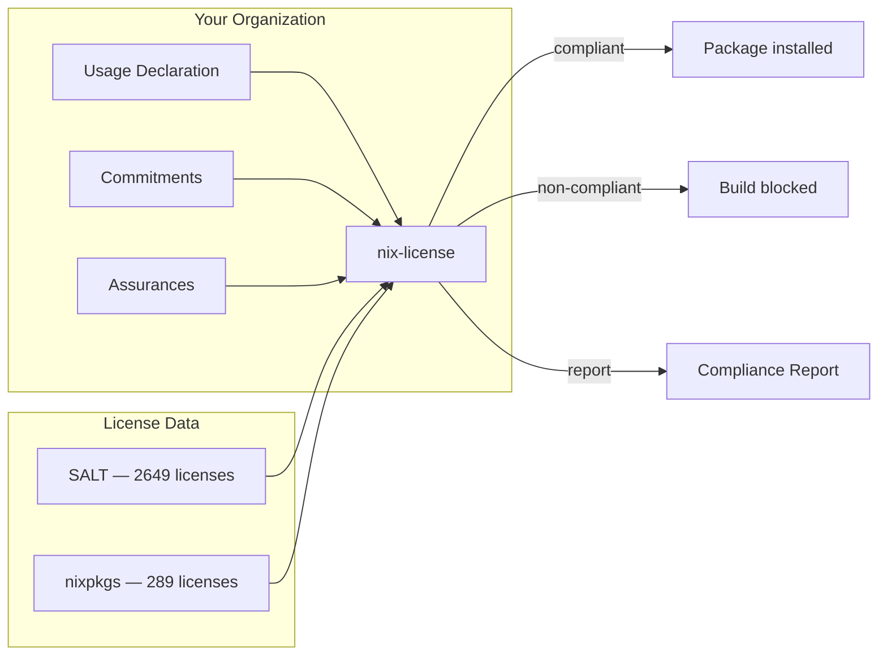
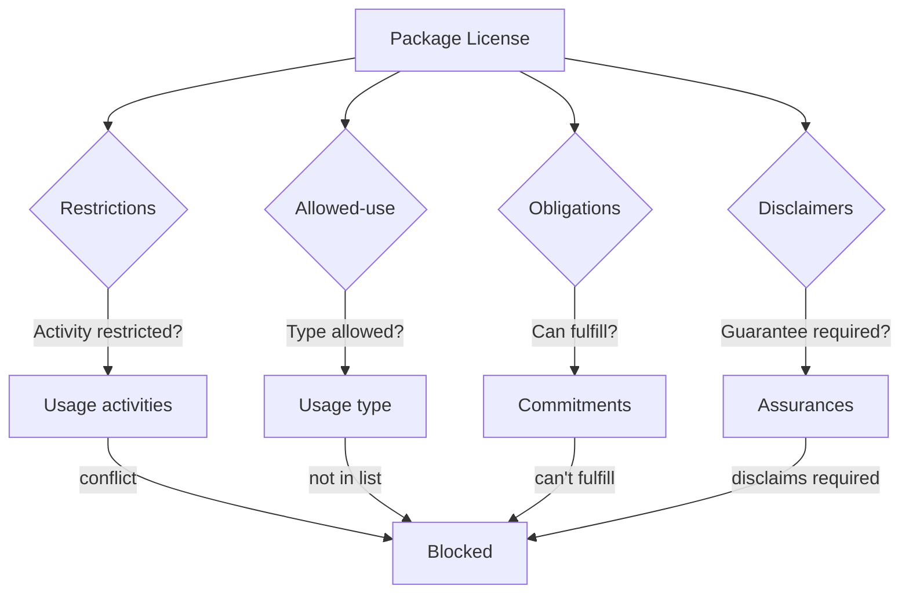

# Compliance

## How nix-license works

nix-license evaluates every package's license against your organization's declared usage at build time. Non-compliant packages are blocked before they enter your system.



## Four compliance checks

Every package is evaluated against four checks. All must pass.



| Check | License says | User declares | Blocks when |
|-------|-------------|---------------|-------------|
| Restrictions | What the license prohibits | Usage activities | Activity is restricted |
| Allowed-use | Who the license permits | Usage type | Type not in allowed list |
| Obligations | What the license requires | Commitments | Obligation triggers and user can't fulfill |
| Disclaimers | What the license doesn't guarantee | Assurances | License disclaims what user requires |

## Compliance operations

### 1. Declare usage

The organization declares who they are and what they do. All fields are required — no implicit assumptions.

```nix
usage = {
  type = "commercial";     # who: personal, commercial, educational, research, government, nonprofit
  commercial-use = true;   # what: for-profit activity
  distribution = true;     # what: shipping software to others
  modifications = true;    # what: changing source code
  saas = false;            # what: hosting as a service
};
```

### 2. Declare commitments

The organization declares which license obligations they can fulfill. If an obligation triggers and the commitment is `fulfilled = false`, the package is blocked.

```nix
commitments.same-license.fulfilled = false;    # can't open-source → blocks GPL
commitments.disclose-source.fulfilled = false;  # can't share source → blocks copyleft
```

### 3. Declare assurances

The organization declares what guarantees they require from licenses. If a license disclaims a required guarantee, the package is blocked.

```nix
assurances.source-available = {
  required = true;                      # require source code
  exceptions = [ "nvidia-x11" ];        # except NVIDIA drivers
};
assurances.patent-grant.required = true;  # require patent rights
```

### 4. Enforce

| Mode | Behavior |
|------|----------|
| `warn` | Non-compliant packages produce warnings but are allowed |
| `enforce` | Non-compliant packages fail at build time |

### 5. Report

A compliance report (JSON + HTML) lists every package, its license, and its compliance status. Reports are a commercial feature.

```bash
nix build .#nixosConfigurations.myhost.config.nix-license.report
xdg-open result/index.html
```

## License data: SALT

All license data comes from [SALT](https://github.com/i-am-logger/salt) (Software And License Taxonomy) — 2649 licenses classified with:

| Term | What it is |
|------|-----------|
| Grants | What the license permits |
| Restrictions | What the license prohibits |
| Obligations | What the license requires you to do |
| Disclaimers | What the license doesn't guarantee |

nix-license maps all 289 nixpkgs licenses to SALT classifications. The mapping is verified exhaustively — every license, every usage context, every combination.

## License verification

Commercial licenses are self-validating — the signer's public key is embedded in the license file:

```json
{
  "package": "vendor-package",
  "commercial": true,
  "licensee": "Acme Corp",
  "expires_at": "2027-01-15",
  "publicKey": "MCowBQYDK2VwAyEA...",
  "integrity": { "algorithm": "sha256", "digest": "23e02d..." }
}
```

### License format

```json
{
  "package": "vendor-package",
  "commercial": true,
  "licensee": "Acme Corp",
  "licensee_id": "acme-2026-001",
  "issued_at": "2026-01-15",
  "expires_at": "2027-01-15",
  "publicKey": "MCowBQYDK2VwAyEA..."
}
```

| Field | Required | Description |
|-------|----------|-------------|
| `package` | yes | Package name this license covers |
| `commercial` | yes | Grants commercial use |
| `licensee` | yes | Organization or person licensed |
| `licensee_id` | no | License ID for records |
| `issued_at` | no | When the license was issued (ISO 8601) |
| `expires_at` | no | When the license expires (ISO 8601) |
| `publicKey` | yes | Signer's public key (base64) |
| `integrity` | yes | `{ algorithm, digest }` — SHA-256 hash of the license content (excluding integrity field) |

The license file + detached signature (`.sig`) form a complete, self-validating credential. The signature covers the entire JSON — any tampering invalidates it. The integrity hash enables quick comparison and future chain linking.

### Two levels of verification

| Level | What it checks | Who can do it |
|-------|---------------|---------------|
| Self-validation | Signature matches the `publicKey` in the license | Anyone holding the license |
| Trust validation | `publicKey` matches the vendor key in `keys/vendors/` | nix-license |

nix-license supports any signing algorithm:

| Signer | Algorithm | Verifier |
|--------|-----------|----------|
| nix-license (author) | GPG/YubiKey (Ed25519) | `gpg --verify` |
| Vendors | Any (Ed25519, RSA, ECDSA) | `openssl pkeyutl -verify` |

Vendor public keys are embedded in `keys/vendors/`. In enforce mode, every commercial license must be cryptographically verified — no vendor key means the package is blocked.

## Restriction vocabulary

SALT defines its own vocabulary for restrictions, obligations, and disclaimers. These terms were validated against [OSADL OSLOC](https://github.com/osadl/OSLOC) (Open Source License Obligation Checklists) to ensure alignment with established legal concepts, but SALT is an independent taxonomy.

## Content ratings: OARS 1.1

Per-user content policies use [OARS 1.1](https://github.com/hughsie/oars) (22 categories). Resolved policies are written to `/etc/nix-license/content-policy/` as immutable files for apps to query at runtime.

## Standards alignment

### OpenChain ISO/IEC 5230

See [OPENCHAIN.md](OPENCHAIN.md) for the full specification mapping — requirement-by-requirement coverage analysis with diagrams.
