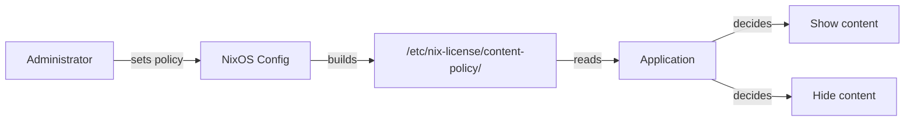

# Content Policy

Per-user content entitlements based on [OARS 1.1](https://github.com/hughsie/oars) (Open Age Ratings Service). Administrators set what content each user is entitled to. Apps query the policy at runtime.

## How it works



1. Administrator declares content policies in NixOS config
2. nix-license writes resolved policies to `/etc/nix-license/content-policy/` as immutable Nix store symlinks
3. Apps read the policy file and decide what to show

nix-license provides the policy. Apps enforce it.

## OARS 1.1

22 content categories derived from the upstream RNC schema:

| Category | Examples |
|----------|---------|
| `violence-cartoon` | Cartoon violence |
| `violence-fantasy` | Fantasy violence |
| `violence-realistic` | Realistic violence |
| `violence-bloodshed` | Blood and gore |
| `violence-sexual` | Sexual violence |
| `violence-desecration` | Desecration of corpses |
| `violence-slavery` | Depictions of slavery |
| `drugs-alcohol` | Alcohol use |
| `drugs-narcotics` | Drug use |
| `drugs-tobacco` | Tobacco use |
| `sex-nudity` | Nudity |
| `sex-themes` | Sexual themes |
| `language-profanity` | Profanity |
| `language-humor` | Crude humor |
| `language-discrimination` | Discriminatory language |
| `social-chat` | Online chat |
| `social-info` | Sharing personal info |
| `social-audio` | Voice chat |
| `social-location` | Location sharing |
| `social-contacts` | Contact sharing |
| `money-purchasing` | In-app purchases |
| `money-gambling` | Gambling |

Each category has a severity level: `none` < `mild` < `moderate` < `intense`

## Presets

| Preset | Description |
|--------|-------------|
| `child` | Restrictive — blocks violence, social, gambling, adult content |
| `teen` | Moderate — allows mild/moderate in most categories |
| `unrestricted` | Everything allowed (default) |

## Configuration

### System-wide default

```nix
nix-license.contentPolicy = {
  preset = "teen";
};
```

### Per-user (via mynixos)

```nix
my.users.logger.contentPolicy = "unrestricted";

my.users.son.contentPolicy = {
  preset = "child";
  violence-cartoon = "moderate";  # allow some cartoon violence
};
```

### Per-category overrides

Any category can be overridden regardless of preset:

```nix
my.users.teen.contentPolicy = {
  preset = "teen";
  money-gambling = "none";      # stricter: no gambling
  language-humor = "intense";   # looser: allow crude humor
};
```

## Policy files

Resolved policies are written as immutable JSON files:

```
/etc/nix-license/content-policy/
├── system.json     # root:root 0644 — system default, apps fallback
├── logger.json     # logger:root 0400 — user-specific
└── son.json        # son:root 0400 — user-specific
```

- **System**: readable by all (apps need it as fallback)
- **Per-user**: readable only by that user and root
- **Immutable**: symlinks to Nix store — cannot be modified

### File format

```json
{
  "violence-cartoon": "moderate",
  "violence-fantasy": "none",
  "violence-realistic": "none",
  "drugs-alcohol": "none",
  "sex-nudity": "none",
  "language-profanity": "mild",
  "social-chat": "moderate",
  "money-gambling": "none",
  "money-purchasing": "mild",
  "allowUnrated": false
}
```

## Runtime enforcement

Apps read the policy file and decide what to show:

```python
# pseudocode
import json

user = os.getenv("USER")
path = f"/etc/nix-license/content-policy/{user}.json"
if not os.path.exists(path):
    path = "/etc/nix-license/content-policy/system.json"

policy = json.load(open(path))

if severity_level(app_rating["violence-realistic"]) > severity_level(policy["violence-realistic"]):
    # content exceeds user's policy
    hide_or_block()
```

nix-license does not enforce content policy at runtime — it provides the policy. Enforcement is the app's responsibility.

## Why not age verification?

California (AB 2273), Colorado, New York, and other states are pushing age verification laws that require platforms to verify users' ages before allowing access to content. This approach has fundamental problems:

| | Age verification | Content policy (nix-license) |
|---|---|---|
| **Privacy** | Requires PII (birth date, ID scan, face scan) | No PII — policy is set by the administrator, not the user |
| **Who decides** | Each app decides what age means | Administrator decides once, system enforces consistently |
| **Enforcement** | App-by-app, inconsistent | System-wide, one policy per user |
| **Data storage** | Age data must be stored or verified | No user data stored — policy is a config file |
| **Granularity** | Binary (old enough or not) | 22 categories × 4 severity levels |
| **Control** | User/platform | Parent/admin/organization |

Age verification asks: **"How old is the user?"** and lets every app interpret that differently.

Content policy asks: **"What is this user entitled to?"** and enforces it consistently at the system level.

A parent sets `my.users.son.contentPolicy = "child"` and every app on the system respects it. No birth dates, no ID scans, no data collection. The policy is immutable — the child cannot change it.

### No PII by design

nix-license content policy stores **zero personally identifiable information**:

- No birth dates
- No age data
- No ID documents
- No biometric data
- No user accounts or passwords
- No network requests to verify identity

The policy file contains only severity levels per content category — what the user is entitled to, not who the user is. The administrator (parent, IT admin, school) sets the policy. The user cannot modify it (Nix store symlink, read-only).

Even if the policy file is leaked, it reveals nothing about the user's identity — only that someone named "son" is restricted from gambling content. No harm.

## Build-time enforcement

Build-time content checking requires packages to have `meta.contentRating` (an OARS attrset). nixpkgs does not currently provide this data.

See [#15](https://github.com/i-am-logger/nix-license/issues/15) for the overlay approach to sourcing OARS ratings from AppStream metadata.

## Domain invariants

The content policy system is verified by exhaustive testing:

| Property | Verified by |
|----------|-------------|
| Severity levels form a total order | `content-rating/severity` |
| child < teen < unrestricted | `content-rating/policy` |
| Relaxing a policy never removes access | `content-rating/policy` |
| Resolving a policy is stable (idempotent) | `content-rating/policy` |
