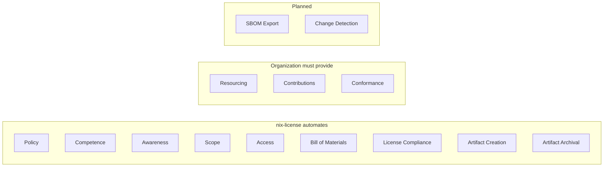
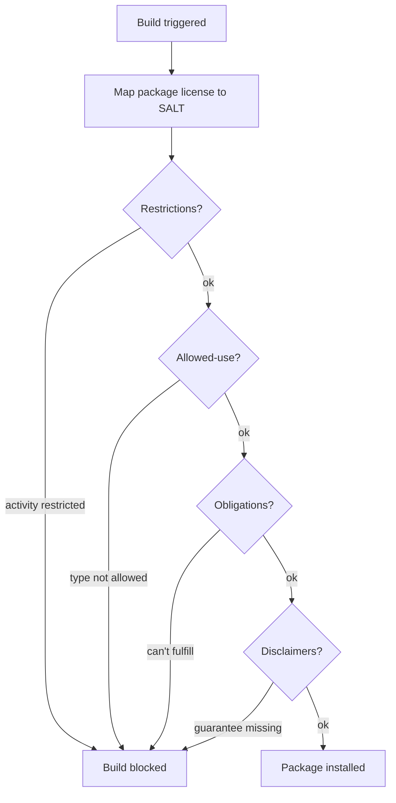

# OpenChain ISO/IEC 5230 Conformance

[OpenChain ISO/IEC 5230](https://openchainproject.org/license-compliance) is the international standard for open source license compliance programs. This document maps every OpenChain requirement to nix-license.

## Coverage: 9 of 14 requirements automated

## Requirement-by-requirement

### 1. Program foundation

<table>
<tr><th width="60">Status</th><th>Requirement</th><th>OpenChain says</th><th>nix-license provides</th></tr>
<tr>
<td><b style="color:#3fb950">covered</b></td>
<td>1.1 Policy</td>
<td>Written open source policy exists</td>
<td>Usage declaration is the policy — type, activities, commitments, assurances. Declarative, version-controlled, reviewed in PRs.</td>
</tr>
<tr>
<td><b style="color:#3fb950">covered</b></td>
<td>1.2 Competence</td>
<td>Staff aware of the policy</td>
<td>The policy is NixOS config — every admin sees it. Changes are code changes, reviewed before merge.</td>
</tr>
<tr>
<td><b style="color:#3fb950">covered</b></td>
<td>1.3 Awareness</td>
<td>Staff know where to find the policy</td>
<td>Single file in the system repository. Cannot be lost or forgotten — the build enforces it.</td>
</tr>
<tr>
<td><b style="color:#3fb950">covered</b></td>
<td>1.4 Scope</td>
<td>Program scope is defined</td>
<td>Scope = the NixOS system. Usage type defines who. Activity flags define what. Every package in the closure is checked.</td>
</tr>
</table>

### 2. Relevant tasks defined and supported

<table>
<tr><th width="60">Status</th><th>Requirement</th><th>OpenChain says</th><th>nix-license provides</th></tr>
<tr>
<td><b style="color:#3fb950">covered</b></td>
<td>2.1 Access</td>
<td>Staff can access relevant information</td>
<td>SALT classifies 2649 licenses. Compliance reports (JSON + HTML) show every package's status. <a href="https://i-am-logger.github.io/nix-license/">Example reports</a>.</td>
</tr>
<tr>
<td><b style="color:#8b949e">org</b></td>
<td>2.2 Resourced</td>
<td>Program is staffed and funded</td>
<td>Outside scope. nix-license automates enforcement but cannot staff your compliance team.</td>
</tr>
</table>

### 3. Open source content review and approval

<table>
<tr><th width="60">Status</th><th>Requirement</th><th>OpenChain says</th><th>nix-license provides</th></tr>
<tr>
<td><b style="color:#3fb950">covered</b></td>
<td>3.1 BOM</td>
<td>Process to create and maintain a bill of materials</td>
<td>Compliance report lists every package, version, license, hash, and compliance status. <a href="https://github.com/i-am-logger/nix-license/issues/7">SPDX/CycloneDX export planned</a>.</td>
</tr>
<tr>
<td><b style="color:#3fb950">covered</b></td>
<td>3.2 Compliance</td>
<td>Process to handle each identified license</td>
<td>Four checks run automatically at build time — restrictions, allowed-use, commitments, assurances. Non-compliant packages are blocked.</td>
</tr>
</table>

### 4. Compliance artifact creation and delivery

<table>
<tr><th width="60">Status</th><th>Requirement</th><th>OpenChain says</th><th>nix-license provides</th></tr>
<tr>
<td><b style="color:#3fb950">covered</b></td>
<td>4.1 Artifacts</td>
<td>Process to create required artifacts</td>
<td>Obligations tracked per-package. When distribution triggers <code>disclose-source</code> or <code>include-copyright</code>, the report shows it.</td>
</tr>
<tr>
<td><b style="color:#3fb950">covered</b></td>
<td>4.2 Archival</td>
<td>Artifacts are archived</td>
<td>Nix store is content-addressed and immutable. Reports include SHA-256 integrity hashes. CI uploads reports as artifacts.</td>
</tr>
</table>

### 5. Understanding open source community engagements

<table>
<tr><th width="60">Status</th><th>Requirement</th><th>OpenChain says</th><th>nix-license provides</th></tr>
<tr>
<td><b style="color:#8b949e">org</b></td>
<td>5.1 Contributions</td>
<td>Policy for contributing to open source</td>
<td>Outside scope. Contribution policy is an organizational decision.</td>
</tr>
</table>

### 6. Adherence to the specification

<table>
<tr><th width="60">Status</th><th>Requirement</th><th>OpenChain says</th><th>nix-license provides</th></tr>
<tr>
<td><b style="color:#8b949e">org</b></td>
<td>6.1 Conformance</td>
<td>Organization conforms to the specification</td>
<td>nix-license provides the technical enforcement. The organization must also address staffing and contribution policies.</td>
</tr>
<tr>
<td><b style="color:#3fb950">covered</b></td>
<td>6.2 Duration</td>
<td>Conformance is maintained over time</td>
<td>nix-license runs on every build — compliance is continuous, not periodic. <a href="https://github.com/i-am-logger/nix-license/issues/37">License change detection planned</a>.</td>
</tr>
</table>

## Summary

| | Automated by nix-license | Organization must provide | Planned |
|---|:---:|:---:|:---:|
| **Count** | **10** | **3** | **2** |
| **Requirements** | 1.1, 1.2, 1.3, 1.4, 2.1, 3.1, 3.2, 4.1, 4.2, 6.2 | 2.2, 5.1, 6.1 | SBOM (#7), change detection (#37) |

**Enforced by code.** Most compliance programs are policies written in documents. nix-license enforces compliance at build time — the build won't succeed if you're non-compliant. Policy is code, reviewed in PRs, and enforced on every build. No manual audits, no spreadsheets, no drift between policy and practice.
