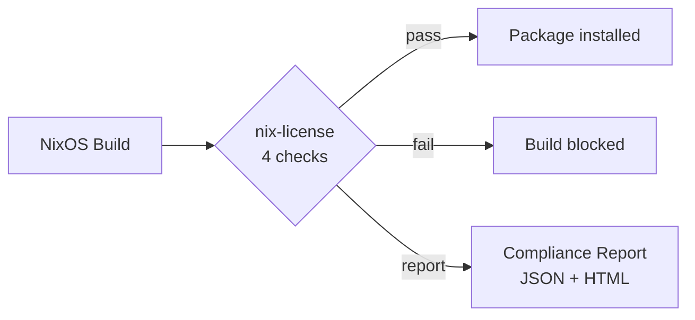
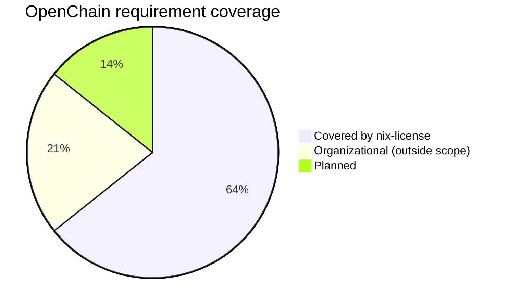

# OpenChain ISO/IEC 5230

[OpenChain ISO/IEC 5230](https://openchainproject.org/license-compliance) is the international standard for open source license compliance programs. Organizations self-certify or undergo third-party audit against the specification.

This document maps OpenChain requirements to nix-license capabilities.

## Specification mapping

### 1. Program foundation

| Requirement | OpenChain | nix-license |
|---|---|---|
| 1.1 Policy | Written open source policy exists | Usage declaration in NixOS config: `usage.type`, `commercial-use`, `distribution`, `modifications`, `saas` |
| 1.2 Competence | Staff are aware of the policy | NixOS config is declarative and version-controlled — the policy is code, reviewed in PRs |
| 1.3 Awareness | Program participants know where to find the policy | `nix-license.usage` is in the system config, visible to all admins |
| 1.4 Scope | Program scope is defined | `usage.type` defines who, activity flags define what. Scope is the NixOS system. |

### 2. Relevant tasks defined and supported

| Requirement | OpenChain | nix-license |
|---|---|---|
| 2.1 Access | Staff can access relevant information | SALT provides 2649 license classifications. `nix-license report` generates per-system compliance reports. |
| 2.2 Effectively resourced | Program is staffed and funded | Outside nix-license scope (organizational) |

### 3. Open source content review and approval

| Requirement | OpenChain | nix-license |
|---|---|---|
| 3.1 Bill of Materials | Process to create and maintain a BOM | `nix-license report` produces a JSON + HTML report of every package, its license, and its compliance status. [SBOM export planned (#7)](https://github.com/i-am-logger/nix-license/issues/7). |
| 3.2 License compliance | Process to handle each identified license | Four compliance checks run at build time: restrictions, allowed-use, commitments, assurances. Every package evaluated automatically. |

### 4. Compliance artifact creation and delivery

| Requirement | OpenChain | nix-license |
|---|---|---|
| 4.1 Compliance artifacts | Process to create required artifacts (source, notices, licenses) | Obligations tracked per-package. When distribution triggers `disclose-source` or `include-copyright`, nix-license reports the obligation. |
| 4.2 Artifact archival | Artifacts are archived | Nix store is content-addressed and immutable. Reports include SHA-256 integrity hashes. |

### 5. Understanding open source community engagements

| Requirement | OpenChain | nix-license |
|---|---|---|
| 5.1 Contributions | Policy for contributing to open source | Outside nix-license scope (organizational) |

### 6. Adherence to the specification requirements

| Requirement | OpenChain | nix-license |
|---|---|---|
| 6.1 Conformance | Organization conforms to the specification | nix-license provides the technical enforcement. The organization must also address staffing, training, and contribution policies. |
| 6.2 Duration | Conformance is maintained over time | nix-license runs on every build. [License change detection planned (#37)](https://github.com/i-am-logger/nix-license/issues/37). |

## Coverage summary

| Status | Count | Requirements |
|--------|-------|-------------|
| Covered | 9 | 1.1, 1.2, 1.3, 1.4, 2.1, 3.1, 3.2, 4.1, 4.2 |
| Organizational | 3 | 2.2, 5.1, 6.1 |
| Planned | 2 | SBOM export (#7), license change detection (#37) |

## How to use nix-license for OpenChain conformance

1. **Define your policy** — declare `usage`, `commitments`, `assurances` in your NixOS config
2. **Enable enforcement** — set `enforcement = "enforce"` to block non-compliant packages
3. **Generate reports** — build compliance reports for audit evidence
4. **Version control** — your NixOS config IS your written policy, tracked in git
5. **Review in PRs** — policy changes are code changes, reviewed before merge
6. **Address organizational requirements** — staffing, training, contribution policies are outside nix-license scope

## Gaps

nix-license is a technical enforcement tool. OpenChain also requires:

- **Staffing** (2.2) — the program must be resourced
- **Contribution policy** (5.1) — rules for contributing to open source projects
- **Organizational conformance** (6.1) — management commitment

These are organizational decisions that nix-license cannot automate.
